**Advanced Lane Finding Project**

The goals / steps of this project are the following:

* Compute the camera calibration matrix and distortion coefficients given a set of chessboard images.
* Apply a distortion correction to raw images.
* Use color transforms, gradients, etc., to create a thresholded binary image.
* Apply a perspective transform to rectify binary image ("birds-eye view").
* Detect lane pixels and fit to find the lane boundary.
* Determine the curvature of the lane and vehicle position with respect to center.
* Warp the detected lane boundaries back onto the original image.
* Output visual display of the lane boundaries and numerical estimation of lane curvature and vehicle position.

[//]: # (Image References)

[image1]: ./examples/undistort_output.png "Undistorted"
[image2]: ./test_images/test1.jpg "Road Transformed"
[image3]: ./examples/binary_combo_example.jpg "Binary Example"
[image4]: ./examples/warped_straight_lines.jpg "Warp Example"
[image5]: ./examples/color_fit_lines.jpg "Fit Visual"
[image6]: ./examples/example_output.jpg "Output"
[video1]: ./project_video.mp4 "Video"

## [Rubric](https://review.udacity.com/#!/rubrics/571/view) Points

### Here I will consider the rubric points individually and describe how I addressed each point in my implementation.  

---

### Writeup / README

#### 1. Provide a Writeup / README that includes all the rubric points and how you addressed each one.  

This file itself is the writeup document.

### Camera Calibration

The code for this step is contained in the 1st code cell  of the [IPython notebook](https://github.com/saras152/myAdvancedLaneFinding/blob/master/P4_Advanced_Lane_Finding.ipynb) located in the repo. Most of these code came from the video lectures and notes on the webpages.

I start by preparing "object points", which will be the (x, y, z) coordinates of the chessboard corners in the world. Here I am assuming the chessboard is fixed on the (x, y) plane at z=0, such that the object points are the same for each calibration image.  Thus, `objp` is just a replicated array of coordinates, and `objpoints` will be appended with a copy of it every time I successfully detect all chessboard corners in a test image.  `imgpoints` will be appended with the (x, y) pixel position of each of the corners in the image plane with each successful chessboard detection.  

I then used the output `objpoints` and `imgpoints` to compute the camera calibration and distortion coefficients using the `cv2.calibrateCamera()` function.  I applied this distortion correction to the test image using the `cv2.undistort()` function and obtained this result: 

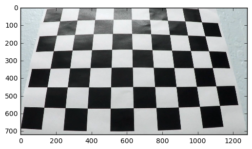 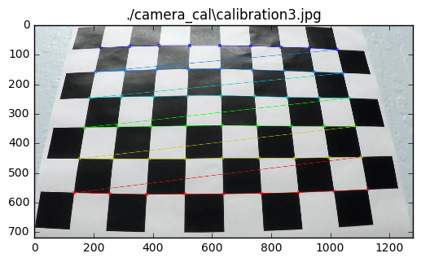

### Pipeline (single images)

#### 1. Provide an example of a distortion-corrected image.
One of the sample images is used for creating distorsion correction, based on the calibration data from the earlier step. Sample image set is posted below.

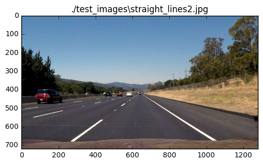 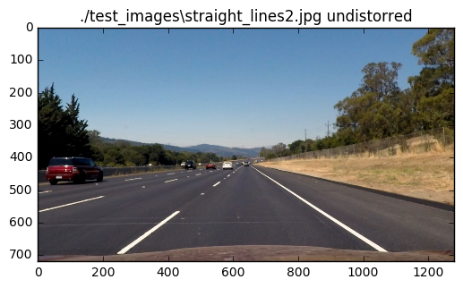

#### 2. Describe how (and identify where in your code) you used color transforms, gradients or other methods to create a thresholded binary image.  Provide an example of a binary image result.

I used a combination of X-gradient, Saturation, absolute of gradients, and direction of gradients thresholds to generate a binary image. These are implemented in independent functions in 4th code segment of the jupyter notebook in the project repo. These functions are used with appropriate hyperparametrs in the function process_image. 

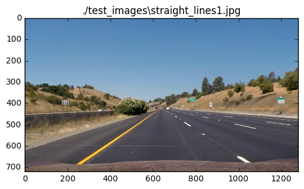 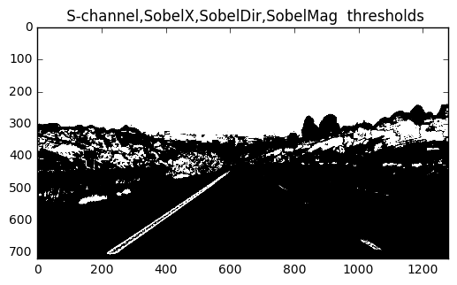
 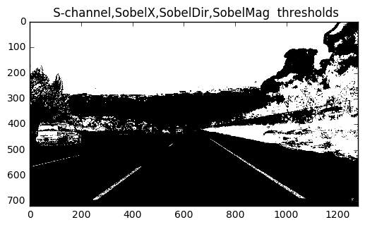
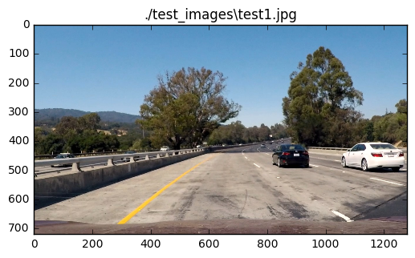 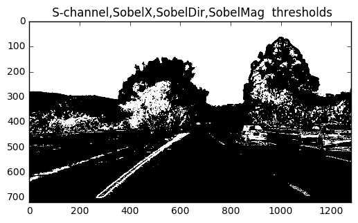
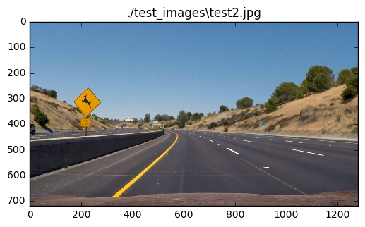 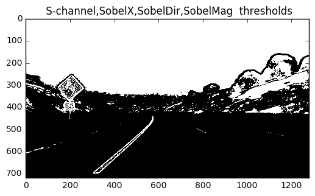
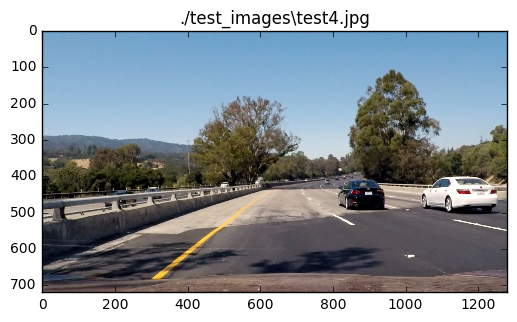 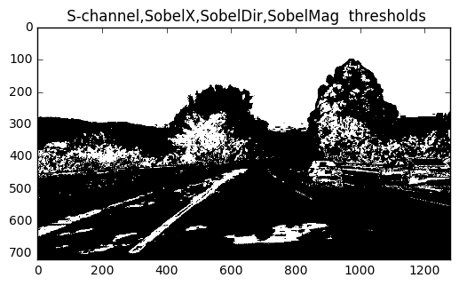

#### 3. Describe how (and identify where in your code) you performed a perspective transform and provide an example of a transformed image.

I used hard coded source and destination coordinates for the tranform. These values are arrived at by finetuning on one of the test image with straight road. 

'src=np.float32([[200,720],[595,450],[688,450],[1100,720]])'

'dst = np.float32([[300,720],[300,0],[1000,0],[1000, 720]])'

These source and destination points are used for transforming the images using 'cv2.warpPerspective' function on the binary image. 

I verified that my perspective transform was working as expected by drawing the `src` and `dst` points onto a test image and its warped counterpart to verify that the lines appear parallel in the warped image.

 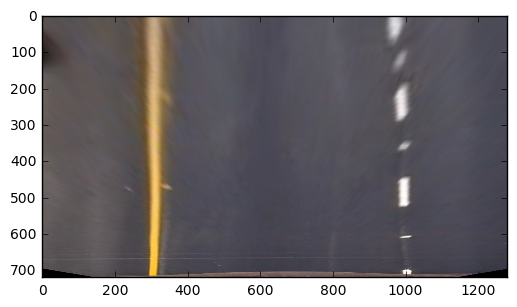

#### 4. Describe how (and identify where in your code) you identified lane-line pixels and fit their positions with a polynomial?

Then I took histogram of bottom half of the warped image of the binary image, with its columns added up. This resulted in a pixel intensity 

 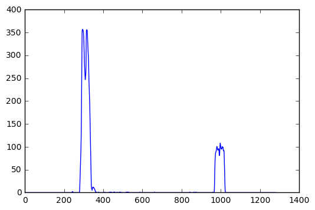

The peaks of the histograms give an indication of where to start searching for the lane lines. Then I divide the image to two halves, right and left. Vertical direction of the image is divided into 9 sections and for each section, the location of maximum pixel density is identified. Starting from this point, the middle portion of the pixels whose pixel intensity is more than a threshold is selected as the lane line mark. This process is repeated along the height on each side. For the case where lane line is already known, the new lines are searched within a band of earlier known lane lines.

Result of this process is that a lane line point space is created in 2d. These points are used to create a 2nd order polynomial that may represent the lane lines. 

 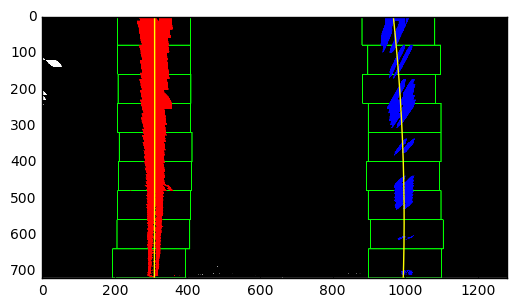

#### 5. Describe how (and identify where in your code) you calculated the radius of curvature of the lane and the position of the vehicle with respect to center.

To match pixel distances with the real world distances, a scaling factor for x and y direction is assumed. The radius of curvature was obtained using the formulae given in a [tutorial](http://www.intmath.com/applications-differentiation/8-radius-curvature.php). The peak points on the bottom half of the histogram of the binary image of the presepective view of the road represent the lane ends. Middle point of these will represent car direction. Assuming that the camera is mounted on the middle of the road, the difference between the lane mid point and the image middle point will give the car's offset when scaled by the appropriate x direction scale. 
This pipeline is implemented in the 4th code block of the notebook in process_image function.

#### 6. Provide an example image of your result plotted back down onto the road such that the lane area is identified clearly.

I implemented this step in 4th code segment to draw a surface out of the boundary lines. This includes generating coordinates of the polynomial out of the fitted curves, filling the polygon, unwarping them to normal view, and then overlapping the polygon onto the normal image. 
The final result of this process on a test image looked like below:

 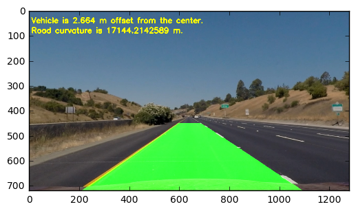

---

### Pipeline (video)

#### 1. Provide a link to your final video output.  Your pipeline should perform reasonably well on the entire project video (wobbly lines are ok but no catastrophic failures that would cause the car to drive off the road!).

Here's a [link to my video result](./output_project_video.mp4)

---

### Discussion

#### 1. Briefly discuss any problems / issues you faced in your implementation of this project.  Where will your pipeline likely fail?  What could you do to make it more robust?

I initially felt that this project is an extension to the first project, the lane line detection pipeline. But I realized that the skillset required for the first project is different. Previous project rquired line fitting, while this project goes one step higher and fits a second order polynomial, changes image perspective to bird's eye view, includes many more threshold schemes to find the lane lines, and gives a much better visual representation of the lanes on the road. 

My pipeline is likely to fail in high contrast situations, with more road shadows ( like it failed to identify lanes for the chalenge_video.mp4). One of the ways it could be made more robust is to include color filters for detecting lane lines. Another approach would be to create the binary image not by 'OR' logic of all the earlier filters, but assign a priority of each filter, which may be changed dynamically over a period of the time. Also, i did not do any sanity checks for distance between lane lines, or paralality of lane lines, etc. Such checks are a must when dealing with real-life conditions. 
